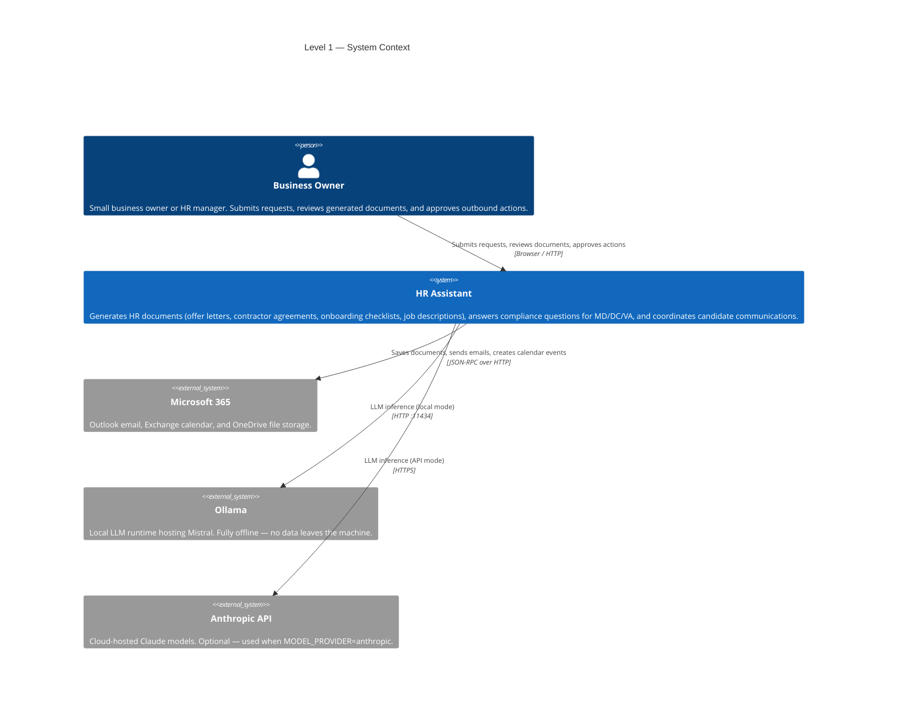
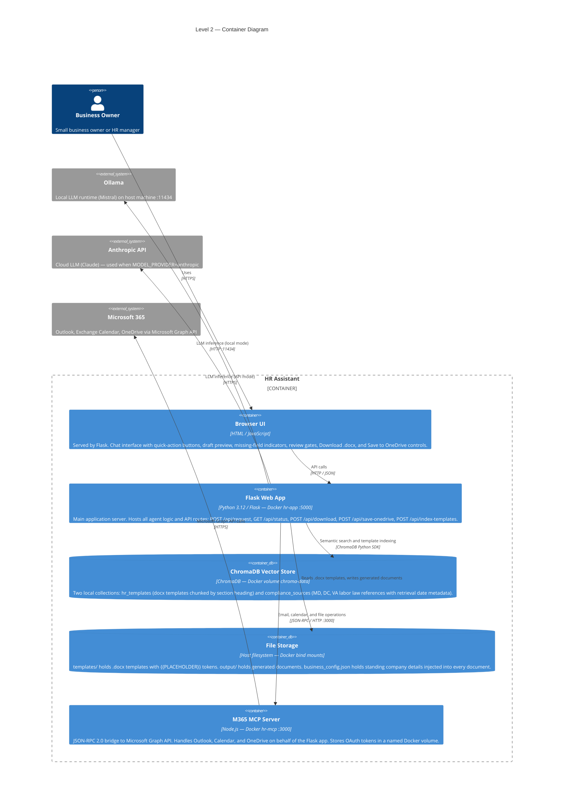
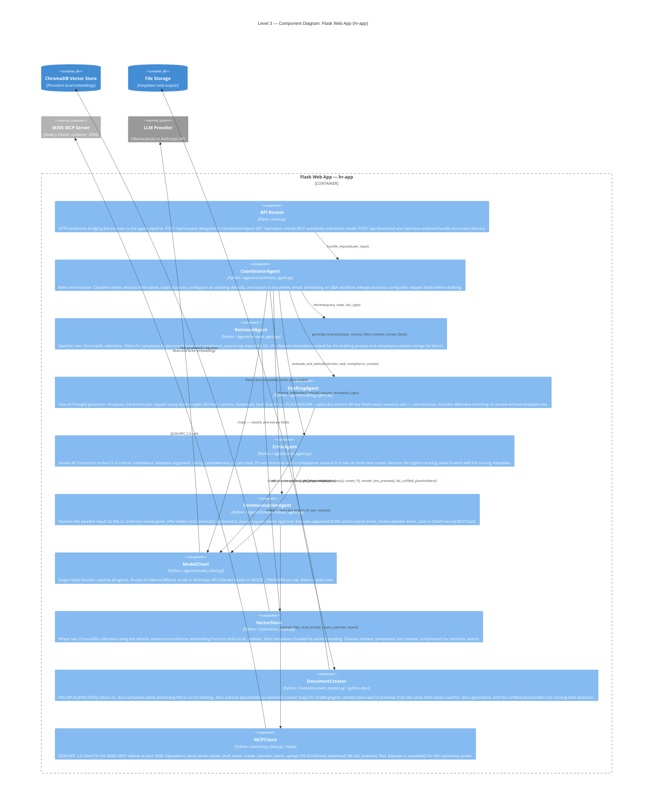
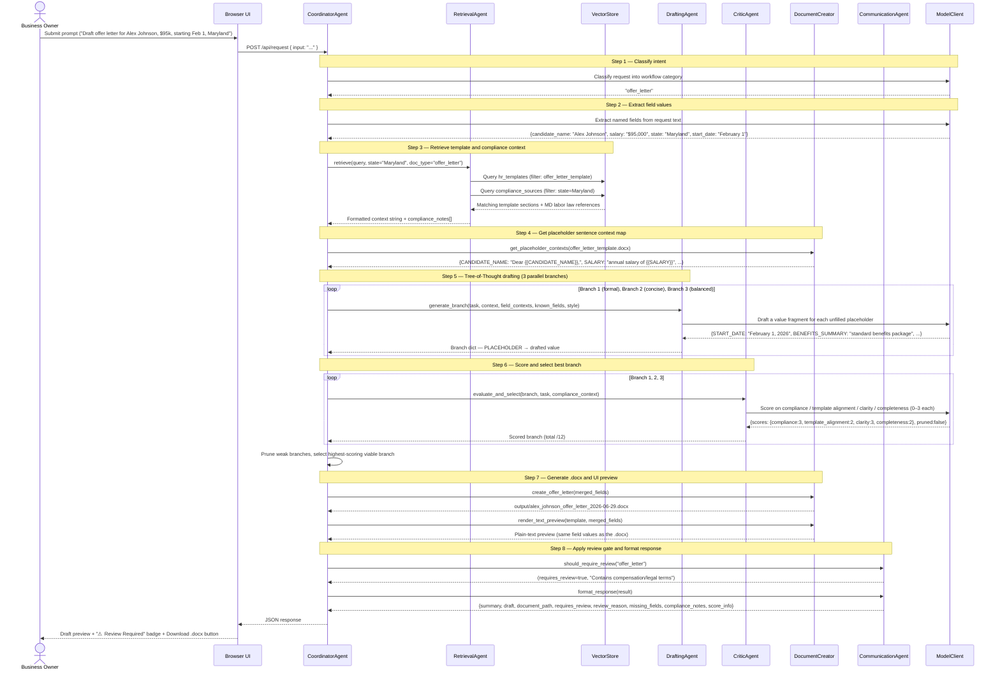

# HR Assistant — Architecture (C4 Model)

Four views following the [C4 model](https://c4model.com): Context → Containers → Components → Dynamic.

---

## Level 1 — System Context

Who uses the system and what external systems it touches.

---

## Level 2 — Container Diagram

The major deployable units, their responsibilities, and how they communicate.

---

## Level 3 — Component Diagram: Flask Web App

The internal components of the `hr-app` container and how they relate.

---

## Dynamic View — Document Request Flow

Runtime sequence for a document request (e.g., an offer letter). This is the full Tree-of-Thought pipeline used for all four document types.

---

### Notes

- **Email, scheduling, and Q&A workflows** skip steps 4–6 (no ToT pipeline). The coordinator calls the LLM directly for a single draft and routes through `CommunicationAgent` with `requires_review=true`.
- **Model provider is runtime-configurable** via `MODEL_PROVIDER` in `.env`. All agents call the same `chat()` function; the switch between Ollama (local) and Anthropic (API) is transparent to the pipeline.
- **Review gates are non-bypassable in the pipeline** — `CommunicationAgent.should_require_review()` is always called for document workflows; the UI download and OneDrive save buttons are only enabled after the owner sees the review badge.